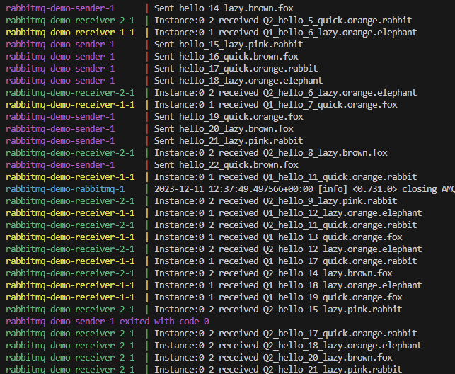

# Rabbit MQ Tutorial with Spring Boot AMQP
# Purpose of project
1. To learn how RabbitMQ works following the [official Spring AMQP tutorial](https://www.rabbitmq.com/tutorials/tutorial-five-spring-amqp.html)
2. Fanout, Direct and Topic exchanges were learnt, but only Topic exchange is demonstrated here.

## Dependencies and Builder
1. Java 17
2. Spring Boot 3
3. Maven
4. Docker
5. make sure to use the `/.vscode/launch.json`

## How to Run
execute `docker-compose up --build` or without the `--build` on subsequent runs.

## How it Works
1. The `docker-compose.yml` first pull the official rabbitmq (_incl. management_) image.
2. The image of the Spring Boot app is then built with `maven:<3.X.X>`.
3. Three containers will be created from that single image, namely "sender", "receiver-1" & "receiver-2".
4. Each of the containers have their own unique env vars and spring.profiles.active.
5. Sender runs on port `8080` and has profile `sender`.
6. `receiver-1` and 2 runs on port `8081` & `8082` respectively and both share the same profile `receiver`.
7. In addition, `receiver-1` and `receiver-2` uses profile `first` and `second` respectively.
8. There are only two queues and both of them are anonymous.
9. The senders will send variying keys to the exchange _["quick.orange.rabbit", "lazy.orange.elephant", "quick.orange.fox",
            "lazy.brown.fox", "lazy.pink.rabbit", "quick.brown.fox"]_
10. Anything that matches `*.orange.*` will be sent to Queue1 (_only receiver-1 will consume_).
11. Anything that matches `*.*.rabbit.*` & `lazy.#` will be sent to Queue2 (_only receiver-2 will consume_).
12. The receivers are configured in such a way that Queue1 is to be consumed by `receiver-1` and Queue2 by `receiver-2`.
13. The console output showcases this:

 

